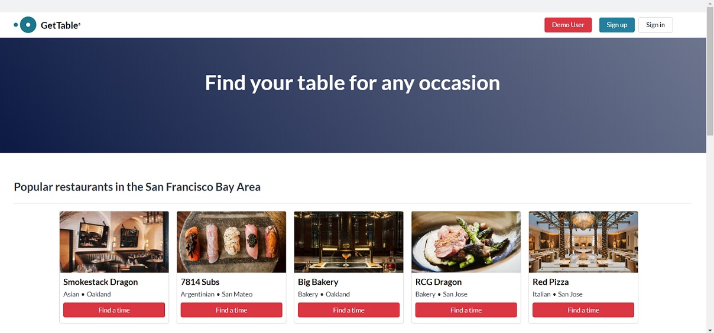

# GetTable

GetTable is a clone of OpenTable, a site where users can find information about restaurants and make reservations. 

Link to the site: https://get-table.onrender.com/

## Screenshot:

## Technologies used

- React JavaScript library for front-end UI
- Redux JavaScript library for state management
- Rails backend
- PostgreSQL database
- AWS S3 for storing seed images
- npm to manage frontend dependencies

## Setup/Installation
1. Clone the project. Then in your terminal, `cd` into the folder.
2. Run `bundle install`
3. Ensure PostgreSQL is running.
4. Run `rails db:setup`
5. In a new terminal, `cd` into the **frontend** folder.
6. Run `npm install`
7. In the first terminal, in the project root directory, run `rails s`
8. In the second terminal, in the **frontend** folder, run `npm start`
9. If it doesn't open automatically, go to http://localhost:3000 in your browser.

## Feature in depth

### Reservation modification

GetTable users can modify their reservations, either immediately after booking, by clicking on the 'Modify' link, or by clicking on the reservation from the user's 'My Reservations' page, which will take the user to the reservation details. 

This navigation to the Modify Reservation page causes a reset of the Redux state, so the reservation ID is retrieved from the URL with `useParams()` to begin the process of reloading the state. The `fetchReservation(reservationId)` thunk action creator is called inside a `useEffect()` hook, which makes an async fetch request to the Rails backend.

In addition to the reservation information, the restaurant information is also retrieved using the `belongs_to` association, and this combined reservation and restaurant information is structured in a Jbuilder view before being sent in the response.

The `getReservation` action is then dispatched, and both the `reservationReducer` and `restaurantReducer` respond, updating their respective slices of state. Finally, the component can be rendered with the user's existing reservation information above the Reservation Update Form. The latter Update Form component receives both the `reservation` and `restaurant` as props so that the form can be prefilled with the user's previously selected choices before modifying the reservation.

<!-- ### Review Form -->

## Future Features

- Search based on location, restaurant, or cuisine